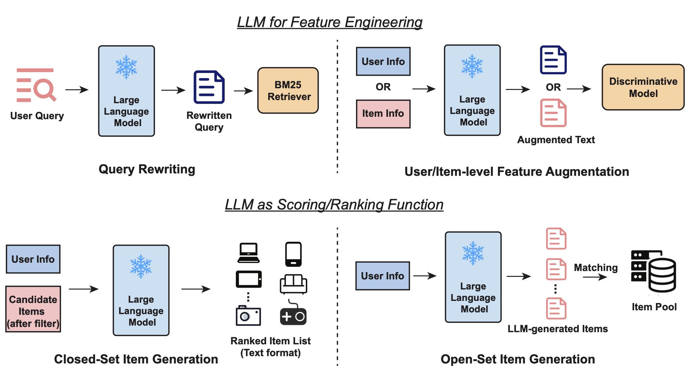
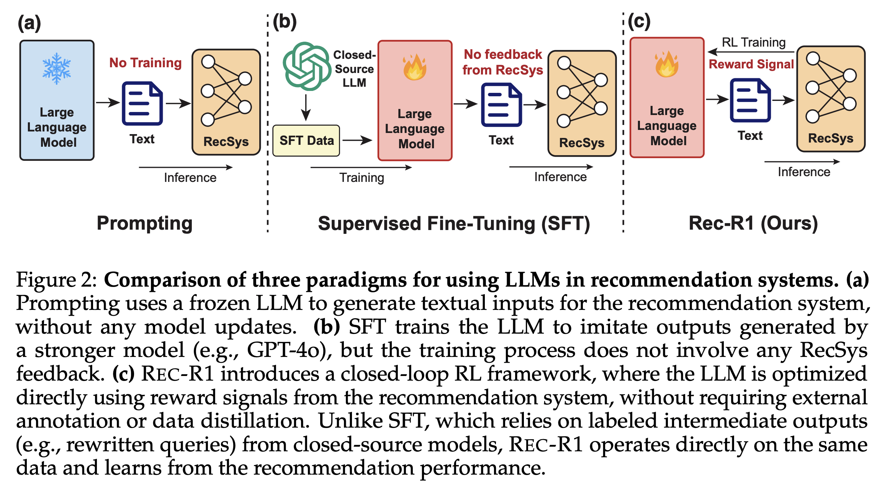

# (Replication Project) Rec-R1: Bridging Generative Large Language Models and User-Centric Recommendation Systems via Reinforcement Learning

<p align="center">
  <a href="https://arxiv.org/pdf/2503.24289">
    
  </a>
</p>

This repository is forked from [the original Rec-R1 repository](https://github.com/linjc16/Rec-R1) and is used for the [CSE 493S/599S](https://courses.cs.washington.edu/courses/cse493s/25sp/) final project for the Spring 2025 quarter at the University of Washington. This project is being done by Justin Chae, Thomas Lilly, Johan Lindqvist, and Yehchan Yoo.

REC-R1 is a general framework that bridges generative large language models (LLMs) and recommendation systems via reinforcement learning. Check the paper [here](https://arxiv.org/pdf/2503.24289).

<p align="center">
  
</p>

<p align="center">
  
</p>

# Replication

Much of our replication work can be done by using the SLURM scripts in `slurm/` (if in a system that supports SLURM) and the Bash scripts in `scripts/repro/`. (For a more detailed step-by-step view of what Bash scripts to run in order, you can take a look at the SLURM scripts!)

If containerization is needed, then you can create a Docker container or an Apptainer based on the files in `docker/`.

It is required that you use a `secrets.env` file with your Weights & Biases API key and your Hugging Face API key to allow the repository to work, as follows, since the repository code involves heavy usage of Weights & Biases and Hugging Face API services:

```
WANDB_API_KEY="<>"
HF_TOKEN="<>"
```

Here is an example Bash code for creating and running an Apptainer:

```
cd docker
apptainer build ngc-vllm.sif ngc-vllm.def
apptainer shell --nv --bind /dev/shm:/dev/shm --bind /gscratch/scrubbed/$USER/Rec-R1_magic:/home/rapids/Rec-R1_magic --env-file ../secrets.env ngc-vllm.sif
```

If you want to make a Conda environment without following the steps in the original README content below, you can also use `environment.yml` to set up the environment. 

# Original README Content

## Installation

```bash
conda create -n zero python=3.10
# install torch [or you can skip this step and let vllm to install the correct version for you]
pip install torch==2.4.0 --index-url https://download.pytorch.org/whl/cu121
# install vllm
pip3 install vllm==0.6.3 # or you can install 0.5.4, 0.4.2 and 0.3.1
pip3 install ray

# verl
pip install -e .

# flash attention 2
pip3 install flash-attn --no-build-isolation
# quality of life
pip install wandb IPython matplotlib

# lucene supported by pyserini
conda install -c conda-forge blis # run this line before pyserini
pip install pyserini
pip install faiss-gpu

# if you don't have jave in the environment
conda install -c conda-forge openjdk=21
export JAVA_HOME=~/miniconda3/envs/zero
export PATH=$JAVA_HOME/bin:$PATH
```


## Get started

**Data Preparation**
```
conda activate zero
python src/dataset/amazon_c4/inst/sparse/subset_data.py
```

### Build a Lucene Database
See the `src/Lucene/README.md` [file](src/Lucene/README.md).

### Run Training
```
conda activate zero
```

For the following code, if you see Out-of-vram, try add `critic.model.enable_gradient_checkpointing=True` to the script


**3B+ model**
```
export N_GPUS=2
export BASE_MODEL=Qwen/Qwen2.5-3B-Instruct
export DATA_DIR=data/matching/qwen-instruct
export ROLLOUT_TP_SIZE=2
export EXPERIMENT_NAME=matching-qwen2.5-3b-inst-ppo
export VLLM_ATTENTION_BACKEND=XFORMERS
export WANDB_API_KEY="[Your_key]"
export HF_HOME="/srv/local/data/linjc/hub"

export CUDA_VISIBLE_DEVICES=0,1

bash scripts/train/train_rec-amazon_c4_3b.sh
```

## Acknowledgements
- [Verl](https://github.com/volcengine/verl) 🔗
- [Pyserini](https://github.com/castorini/pyserini) 🔗
- [Faiss](https://github.com/facebookresearch/faiss) 🔗
